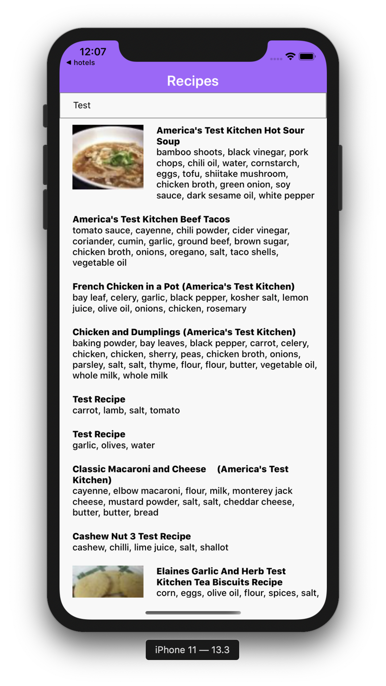

# Recipe Puppy app

To install dependencies run:

### `yarn` and `cd ios && pod install`

In the project directory, you can run:

### `yarn ios` `yarn android`

To run it on simulator/emulator

### `yarn test`

To run all the tests

## Description

Project was bootstrapped with React Native CLI.

App is written in React Native. There is a search and list of fetched recipes with proper tested components, we have custom hook and some helpers functions. 
